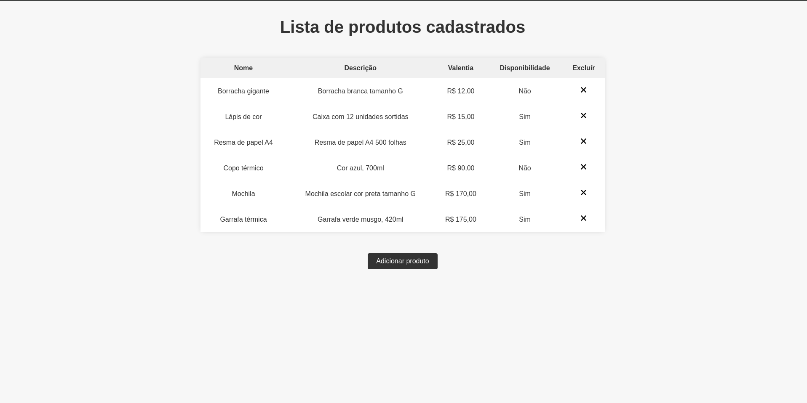
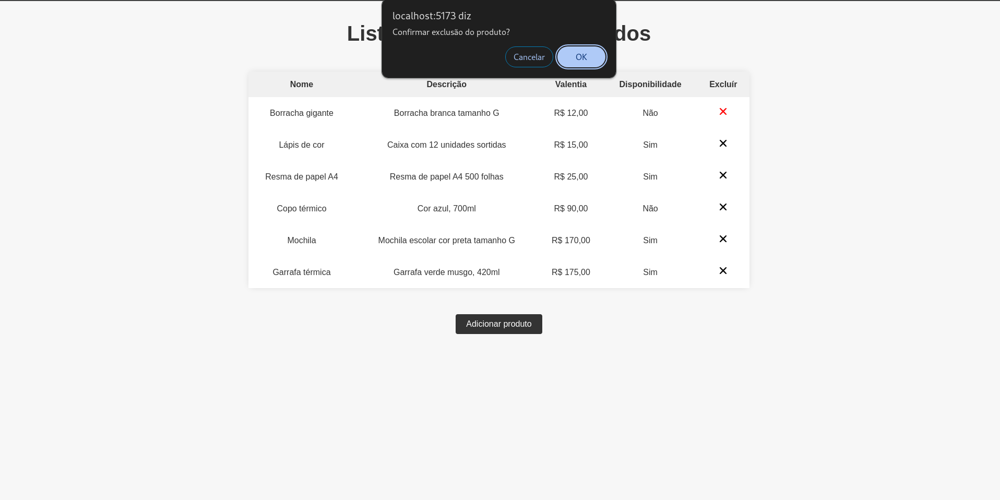
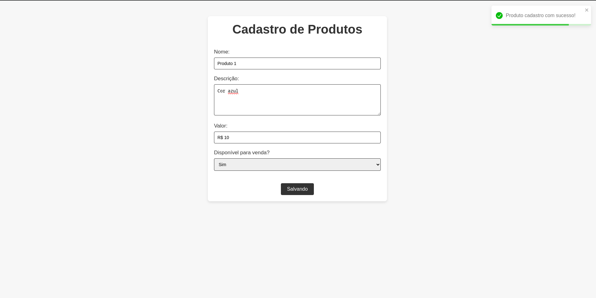

# Cadastro e listagem de produtos

## Projeto realizado utilizando React, Typescript e o ContextAPI. Nesta aplicação os produtos são ordenados por ordem crescente e é possível excluir um produto criado e adicionar quantos forem necessários.

  
  
  

  Feito com ♡ por Helen Andrade

